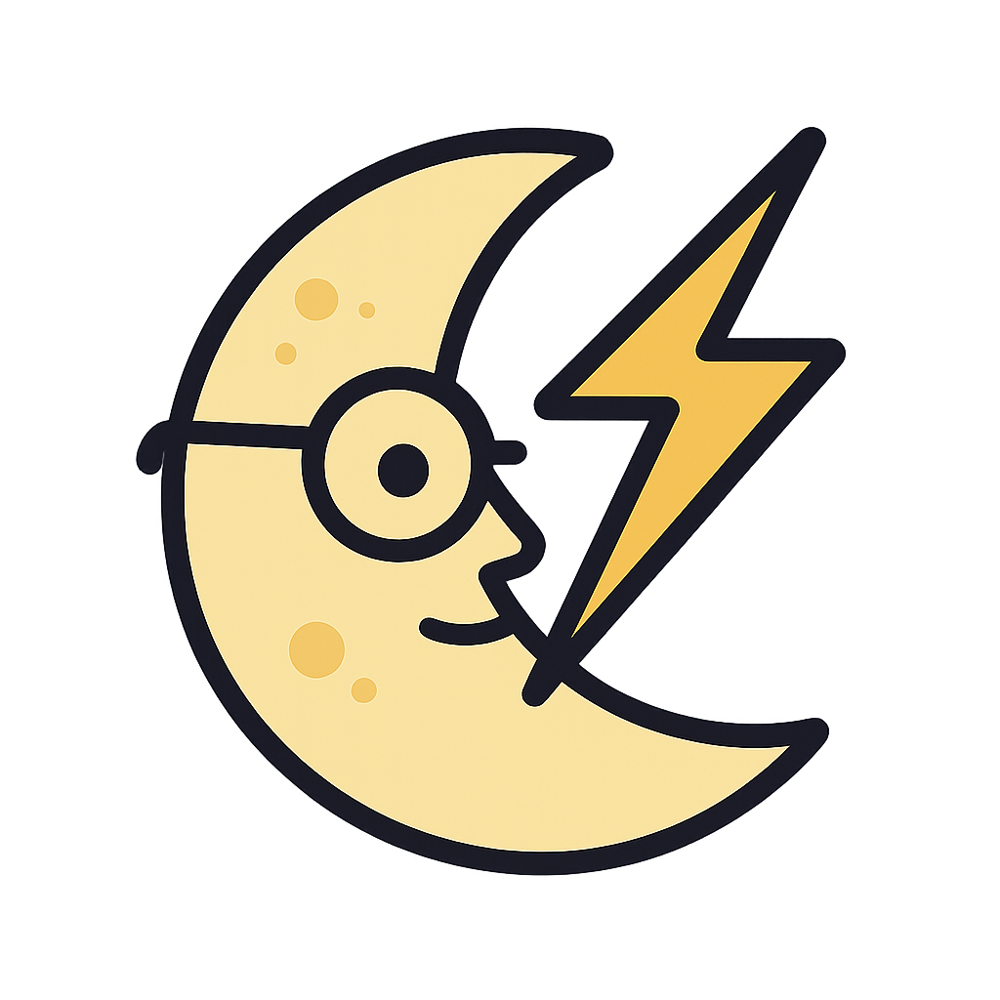

<!-- badge-style for a small logo -->
<p align="left">
  
</p>


# Moonlight-4eyes 
- Automatically lock the Moonlight FPS cap to the primary display's refresh rate

**What it does:**
Anytime the Moonlight Flatpak client is opened in SteamOS, this wrapper will automatically change the Moonlight FPS cap to the client device's refresh rate via modification of the `Moonlight.conf' file. Combining this wrapper with Host-side FPS limiters such as Qres.exe or [frl-toggle (for Nvidia users)](https://github.com/FrogTheFrog/frl-toggle), will help you achieve the smoothest possible streaming experience. 

**Requirements:**
1. SteamOS
2. Standard Flatpak install of Moonlight
3. Optional - MoonDeck Plugin - see step 2 of "Post-install Setup"

**Installation:**

- **Clone the repo & run `install.sh`**  
  ```bash
  git clone https://github.com/Apocrei/moonlight-4eyes.git
  cd moonlight-4eyes
  ./install.sh

**Post-install Setup:**

1. **In SteamOS Desktop Mode**  
   - Open **Steam** Go to **Games → Add a Non-Steam Game**  
   - Browse to `$HOME/bin/moonlight` and click **Add**.

2. **In MoonDeck’s settings (optional)**  
   - Find the **Moonlight executable** field  
   - Enter:  
     ```
     $HOME/bin/moonlight
     ```

That’s all—

Going forward, whenever you launch Moonlight, this program will automatically set the Moonlight framerate cap to the refresh rate of your client-side display. 


**Uninstall:**

- **Run `uninstall.sh`**  
  ```bash
  cd moonlight-4eyes
  ./uninstall.sh

Note: Any desktop or menu shortcuts created while the wrapper was installed may no longer work after the wrapper has been uninstalled. Simply delete these shortcuts and create new ones as needed.
